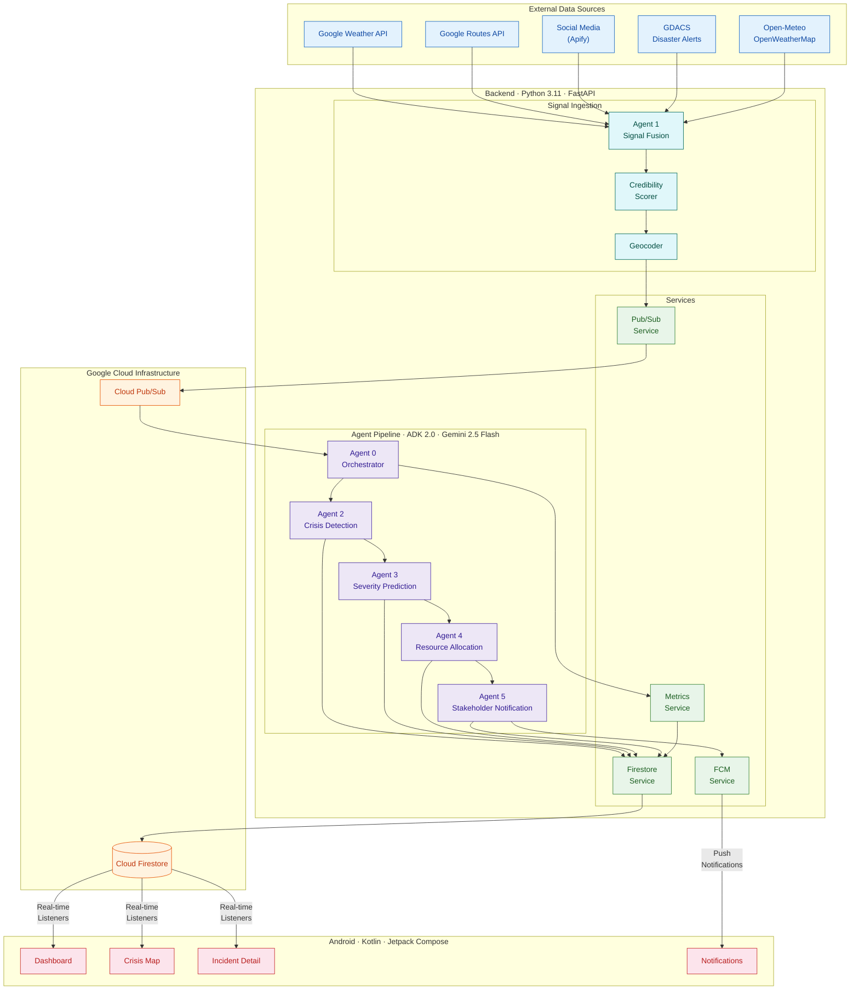

<p align="center">
  <strong>C I R O</strong><br>
  <em>Crisis Intelligence & Response Orchestrator</em>
</p>

<p align="center">
  
  
  
  
  
</p>

---

A multi-agent AI system that detects urban crises in real time, predicts severity, allocates resources, and notifies stakeholders — all within seconds. Built for Islamabad, Pakistan as a proof-of-concept for national disaster management.

**Target:** Signal-to-dispatch in under 60 seconds (vs. 10–20 minutes with manual coordination).

---

## Architecture



---

## Agent Pipeline

| Agent | Role | Key Capability |
|:------|:-----|:---------------|
| **Orchestrator** | Routes events through the pipeline based on confidence | Confidence-based routing: `<0.4` monitor, `0.4–0.6` hypothesis, `0.6–0.8` verify, `>0.8` full response |
| **Signal Fusion** | Collects and fuses multi-source signals | Weather, traffic, social media, GDACS, credibility scoring |
| **Crisis Detection** | Classifies crisis type and sets initial state | Gemini-powered classification with contradiction handling |
| **Severity Prediction** | Forecasts severity and spread risk | Vulnerable facility scanning (Places API), population impact |
| **Resource Allocation** | Assigns resources with priority scoring | Travel-time-aware allocation (Routes API), trade-off narratives |
| **Stakeholder Notification** | Generates tailored alerts and simulates response | Bilingual (English/Urdu), 6 stakeholder types, FCM push |

---

## Tech Stack & Integrations

| Layer | Technologies |
|:------|:-------------|
| AI Framework | Google Agent Development Kit (ADK) 2.0, Gemini 2.5 Flash |
| Backend | Python 3.11, FastAPI, Pydantic v2 |
| Database | Cloud Firestore (real-time sync) |
| Messaging | Cloud Pub/Sub (event bus), Firebase Cloud Messaging (push) |
| Android UI | Kotlin, Jetpack Compose, Material 3 |

### APIs (Real & Mock)
- **Real APIs Used:** 
  - Google Gemini API (for all agent reasoning and intelligence)
  - Firebase / Cloud Firestore API (for real-time data sync)
  - Firebase Cloud Messaging (FCM) API (for push notifications)
  - GNews API (for live Pakistan news feed fallback)
- **Simulated / Mocked APIs (for demo safety):**
  - Google Weather, Routes, Geocoding, and Places APIs (simulated in demo scenarios to avoid quota exhaustion during hackathon judging)
  - GDACS & Apify Social Media (simulated signal fusion inputs)

### Integrations Implemented
- **Firebase Realtime Sync:** Bi-directional real-time data binding between the Python FastAPI backend pipeline and the Kotlin Jetpack Compose dashboard via Firestore listeners.
- **Push Notification Engine:** Integrated Firebase Cloud Messaging (FCM) to dispatch targeted alerts to `public_alerts` and `emergency_services` topics natively to the Android app.
- **RESTful Admin API:** Developed FastAPI endpoints (`/api/trigger-scenario`, `/api/news`) natively consumed by Retrofit/HttpURLConnection in the Android app to allow remote pipeline execution.

---

## Project Structure

```
ciro/
  main.py                          # FastAPI + ADK entrypoint
  agents/
    orchestrator/agent.py          # Agent 0 — pipeline coordination
    signal_fusion/                 # Agent 1 — data collection
      tools/                       #   weather, traffic, social, GDACS, geocoding, credibility
    crisis_detection/agent.py      # Agent 2 — classification
    severity_prediction/agent.py   # Agent 3 — forecasting
    resource_allocation/agent.py   # Agent 4 — optimization
    stakeholder_notification/agent.py # Agent 5 — alerts & simulation
  schemas/                         # Pydantic models (incident, signal, resource, notification)
  services/                        # Firestore, Pub/Sub, FCM, Metrics
android/
  app/src/main/java/com/ciro/app/
    MainActivity.kt                # Navigation host
    data/                          # Models, Firestore repository
    ui/                            # Compose screens (dashboard, map, detail, notifications)
    viewmodel/                     # StateFlow-based state management
    service/                       # FCM messaging service
demo/
  run_demo_scenario.py             # Scripted 12-step crisis simulation
```

---

## Quick Start

### Prerequisites

- Python 3.11+, Google Cloud project with Firestore + Pub/Sub enabled
- Environment variables in `.env`:

```
GOOGLE_API_KEY=<Gemini API key>
GOOGLE_MAPS_API_KEY=<Maps Platform key>
GOOGLE_CLOUD_PROJECT=<GCP project ID>
FIREBASE_CREDENTIALS_PATH=<path to service account JSON>
```

### Run the Backend

```bash
cd ciro
pip install -r requirements.txt
python -m ingestion.seed_resources   # Seed 28 Islamabad resources (run once)
python main.py                       # Starts on http://localhost:8080
```

### Run the Demo

```bash
python demo/run_demo_scenario.py
```

Simulates a 12-step crisis scenario: flood detection in G-10, concurrent heatwave in I-10, resource contention, and false alarm retraction — all visible in real time on the Android app and Firestore console.

### Android App

Open the `android/` directory in Android Studio. Add `google-services.json` to `android/app/`, then build and run on a device or emulator.

---

## Crisis Scenarios

| Scenario | Location | Signals | Outcome |
|:---------|:---------|:--------|:--------|
| Urban Flooding | G-10 Islamabad | Weather + social + GDACS | Full pipeline: detection, resource dispatch, bilingual public alerts |
| Heatwave | I-10 Islamabad | Temperature anomaly | Multi-incident resource contention with trade-off narrative |
| False Alarm Retraction | I-10 Islamabad | Field verification contradicts | Resource release, retraction notifications, audit log |

---

## Firestore Collections

| Collection | Purpose |
|:-----------|:--------|
| `signals` | Raw ingested signals from all sources |
| `incidents` | Crisis incidents with state machine lifecycle |
| `resources` | Emergency resources (ambulances, fire units, rescue teams) |
| `notifications` | Stakeholder messages (6 types per incident) |
| `agent_traces` | Full pipeline execution traces for observability |
| `metrics` | Latency benchmarks and false positive tracking |

---

## License

This project was built for the Google Agent Development Kit Hackathon 2026.
